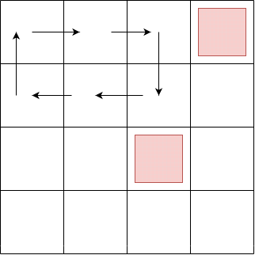

# GFT Technologies - Codility Test

Esercitazione del giorno 20/11/2023.

## Task 1

Sono date le tabelle:
- buses (id, origin, destination, time)
- passengers (id, origin, destination, time)

Supponendo che un passeggero salga solo su autobus diretti e che prenda il primo disponibile, calcolare per ogni autobus il numero di passeggeri a bordo (devono essere presenti anche gli autobus senza passeggeri).

## Task 2

Esiste un robot di pulizie che comincia a lavorare una griglia partendo sempre da in alto a sinistra (posizione 0,0) e muovendosi verso destra. Continua così fintantoché non incontra un ostacolo al primo ostacolo si gira verso destra e continua con questo pattern. Scrivere una funzione che ritorni il numero di celle che il robot riesce a pulire data una certa griglia.

In questo esempio R = {"...X", "....", "..X.", "...."}
la funzione deve ritornare 6.